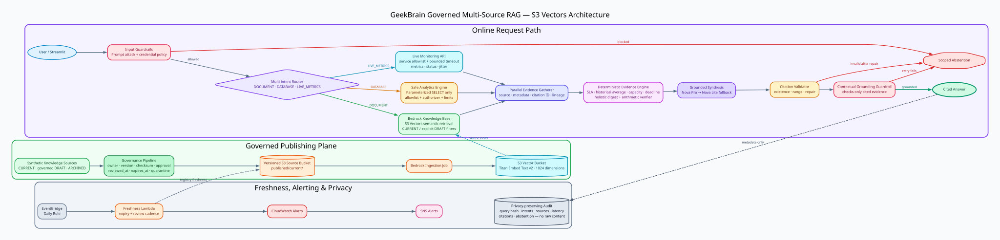

# GeekBrain Governed Multi-Source RAG

Production-oriented RAG agent built with LangGraph, Amazon Bedrock Knowledge Bases and
**S3 Vectors**. It combines governed documents, a read-only analytics database and live
monitoring in one cited answer without exposing arbitrary SQL or raw audit content.

> This public repository contains synthetic GeekBrain fixtures and configuration templates.
> It intentionally excludes local AWS resource identifiers, `.env` files, runtime databases,
> audit logs and build outputs.



## What makes it different

- Accent-insensitive EN/VI multi-intent routing with bounded typo tolerance; one question can use
  `DOCUMENT`, `DATABASE` and `LIVE_METRICS` together.
- Governed ingestion: owner, version, checksum, approval, review date, expiry and status metadata.
- Amazon Bedrock Knowledge Base backed by S3 Vectors; no OpenSearch dependency.
- Read-only analytics with table/column/function allowlists, parameter binding, SQLite authorizer,
  query complexity and result limits.
- Citation-ready deterministic evidence for SLA, historical-average, capacity, deadline and
  holistic cross-source calculations.
- Runtime freshness filtering, explicit draft retrieval and archive exclusion.
- Bedrock Guardrails plus a narrow local credential-exfiltration policy.
- Privacy-preserving audit records: hashes, intents, sources, latency, citations and abstention only.
- Conversation memory and bounded holistic investigation plans.

## Evaluation snapshot

| Suite | Result |
|---|---:|
| L1 + L2 retrieval | 18 / 18 |
| L1 answers | 10 / 10 |
| L2 answers | 8 / 8 |
| L3 grounded computation | 10 / 10 |
| L4 conversations | 6 / 6 conversations, 24 / 24 turns |
| L5 holistic investigations | 5 / 5 |
| Unit and resilience tests | 81 passed |

Live metrics have intentional jitter. The evaluator accepts a bounded tolerance and allows the
observed comparison direction to differ from a static fixture when the live value and historical
baseline are both reported correctly.

## Architecture and flows

- [Architecture, Mermaid flows and sequence diagrams](docs/ARCHITECTURE.md)
- [Capability assessment and remaining limitations](docs/RAG_ASSESSMENT.md)
- [Operations and rollback](OPERATIONS.md)
- [Graphviz source](docs/diagrams/geekbrain-rag-architecture.dot)

## Quick start

```powershell
python -m venv venv
.\venv\Scripts\pip.exe install -e ".[dev]"
Copy-Item .env.example .env
.\venv\Scripts\python.exe data_package\scripts\seed_data.py
.\venv\Scripts\python.exe -m uvicorn data_package.scripts.monitoring_api:app --host 127.0.0.1 --port 8000
```

In another terminal:

```powershell
.\venv\Scripts\streamlit.exe run ui.py
```

Run quality checks:

```powershell
.\venv\Scripts\python.exe -m pytest
.\venv\Scripts\ruff.exe check geekbrain_rag scripts tests graph.py retriever.py tools.py app.py
.\venv\Scripts\python.exe scripts\evaluate.py --mode answer --levels 3
.\venv\Scripts\python.exe scripts\evaluate.py --mode answer --levels 4
.\venv\Scripts\python.exe scripts\evaluate.py --mode answer --levels 5
```

AWS provisioning and ingestion require an authenticated AWS CLI session. Copy generated resource
values only into ignored local configuration or environment variables; never commit them.

## Security boundaries

- No generic arbitrary SQL tool.
- No database mutations, PRAGMA, UNION, comments or unknown tables.
- No raw prompt or answer persistence in the audit database.
- No archived document publishing; drafts require explicit planning language.
- No factual answer without valid in-range citations.
- Missing, stale, malformed or unavailable evidence causes scoped abstention.

## License

No license has been granted yet. Add an explicit license before accepting external contributions.
