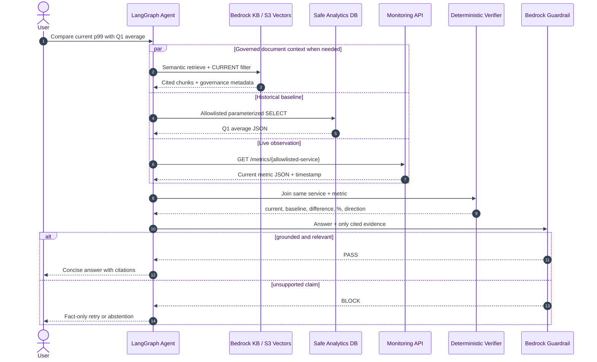
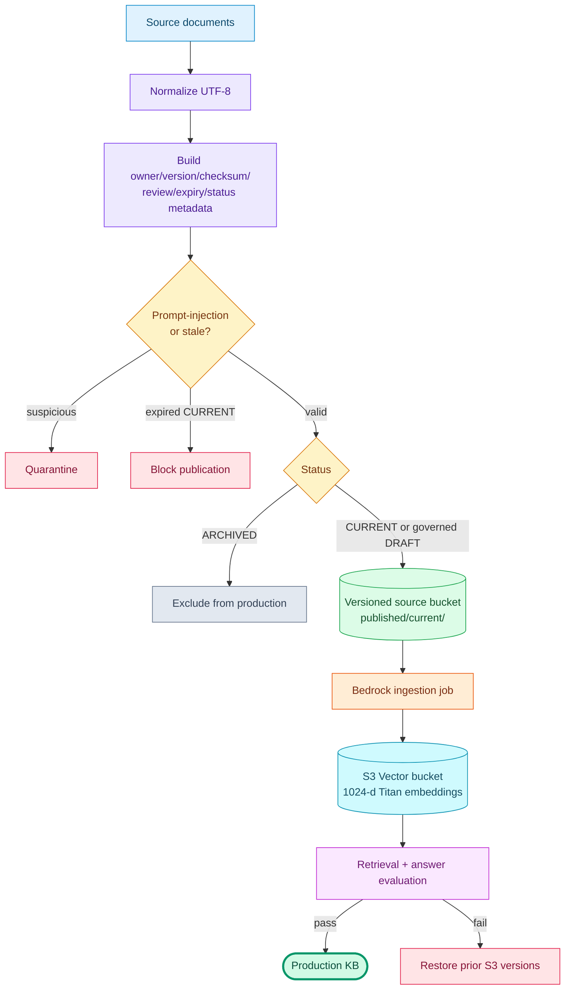

# Kiến trúc và luồng xử lý

## System architecture — Graphviz

SVG dưới đây được render từ
[`geekbrain-rag-architecture.dot`](diagrams/geekbrain-rag-architecture.dot) bằng Graphviz.

## End-to-end request flow — Mermaid

```mermaid
%%{init: {"theme": "base", "themeVariables": {
  "fontFamily": "Inter, Segoe UI, sans-serif",
  "primaryTextColor": "#10233f",
  "lineColor": "#526d82"
}}}%%
flowchart LR
    U([User question]):::user --> IG{Input guardrail}:::guard
    IG -->|blocked| STOP([Safe refusal]):::blocked
    IG -->|allowed| R{Multi-intent router}:::router

    R -->|DOCUMENT| KB[Bedrock KB<br/>S3 Vectors]:::document
    R -->|DATABASE| DB[Safe analytics<br/>SELECT only]:::database
    R -->|LIVE_METRICS| LIVE[Monitoring API<br/>bounded allowlist]:::live

    KB --> G[Evidence gatherer]:::core
    DB --> G
    LIVE --> G

    G --> F{Fresh + valid?}:::decision
    F -->|no evidence| AB([Scoped abstention]):::blocked
    F -->|yes| D[Deterministic DERIVED evidence<br/>SLA · average · capacity · deadline]:::derived
    D --> S[Grounded synthesis<br/>Nova Pro + Lite fallback]:::model
    S --> C{Valid citations?}:::decision
    C -->|repair fails| AB
    C -->|valid| OG{Contextual grounding<br/>cited evidence only}:::guard
    OG -->|blocked| RETRY[Short fact-only retry]:::model
    RETRY --> OG
    OG -->|pass| A([Cited answer]):::success
    A --> AUDIT[(Privacy-preserving audit<br/>hashes + metadata only)]:::audit

    classDef user fill:#e0f2fe,stroke:#0284c7,color:#0c4a6e,stroke-width:2px;
    classDef guard fill:#fff1f2,stroke:#e11d48,color:#881337,stroke-width:2px;
    classDef blocked fill:#ffe4e6,stroke:#be123c,color:#881337,stroke-width:2px;
    classDef router fill:#f3e8ff,stroke:#9333ea,color:#581c87,stroke-width:2px;
    classDef document fill:#dcfce7,stroke:#16a34a,color:#14532d,stroke-width:2px;
    classDef database fill:#fef3c7,stroke:#d97706,color:#78350f,stroke-width:2px;
    classDef live fill:#cffafe,stroke:#0891b2,color:#164e63,stroke-width:2px;
    classDef core fill:#e0e7ff,stroke:#4f46e5,color:#312e81,stroke-width:2px;
    classDef decision fill:#f8fafc,stroke:#64748b,color:#1e293b,stroke-width:2px;
    classDef derived fill:#fae8ff,stroke:#c026d3,color:#701a75,stroke-width:2px;
    classDef model fill:#ede9fe,stroke:#7c3aed,color:#4c1d95,stroke-width:2px;
    classDef success fill:#d1fae5,stroke:#059669,color:#064e3b,stroke-width:3px;
    classDef audit fill:#e2e8f0,stroke:#475569,color:#0f172a,stroke-width:2px;
```

## Cross-source grounding sequence — Mermaid

## Governed publishing flow — Mermaid

